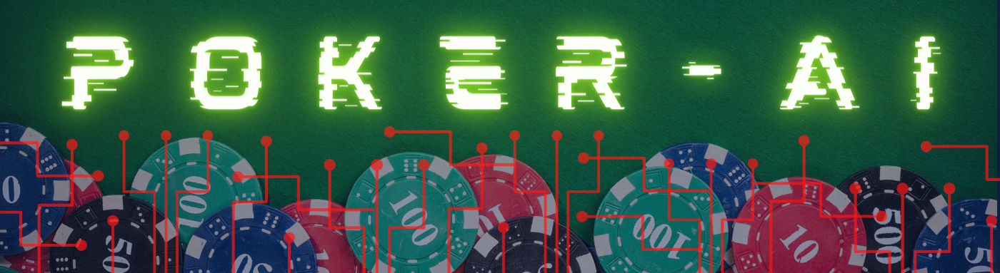

# PokerAI
Deep learning project to improve PokerBots against human players.

## Vision
Facebook proved with [Pluribus](https://ai.facebook.com/blog/pluribus-first-ai-to-beat-pros-in-6-player-poker/) that it is theoretically posibile to beat human players with classical tree-algorithmic-structures in a poker Texas hold 'em game.
Now we want to develop a deep neural network bot which can at least beat moderate to good players in Texas hold 'em.

## Steps
+ create a parser for pokergame logs (e.g. Pluribus, Pokerstars..)
+ draw up a theoretically concept for an artificial intelligence in poker
+ create a lerning concept
+ test the results
+ improve the concepts
+ release an automated bot with a corresponding API
